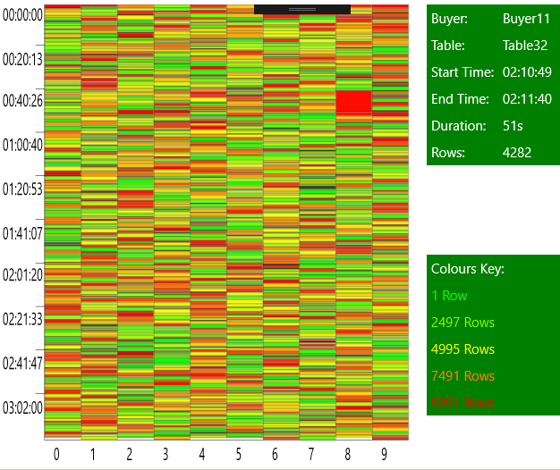

# TaskVisualiser
Visual display of the creation of a S2C datawarehouse when building it using parallel tasks.   This is a Windows10 UWP application.

## Information
* Y axis - is the current time.  In the example the refresh job started at midnight and finished at 3am
* X axis - is each of the parallel tasks.  So there can be 10 things happening at once.
* Each block of colour is a table being created for a buyer
* The taller the block the longer it took
* The colour is based on the number of rows.  Green for not many rows,  and Red for lots of rows
* Moving the mouse over a block of colour will show it's details in the top right.

## Source File
Requires a CSV file with the following structure

First line must be headers
Columns should be
* Start Date  in the format yyyy-MM-dd hh:mm:ss
* End Date  in the format yyyy-MM-dd hh:mm:ss
* Buyer Name
* Table Name
* Number of Rows (integer)

